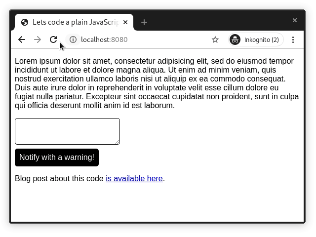

# Lets code a plain JavaScript notification queue using private fields and methods

This repo is part of a tutorial [blog post over here](https://writingjavascript.com/lets-code-a-plain-javascript-notification-queue-using-private-fields-and-methods).

Start reading by opening index.html.

To try this example out, pull the files and run with your favorite HTTP server. For example the npm package http-server.

    $ npm install -g http-server
    $ cd this/repo
    $ http-server

Then visit http://localhost:8080 in your browser.
